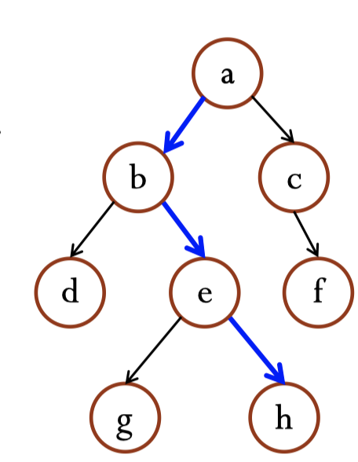
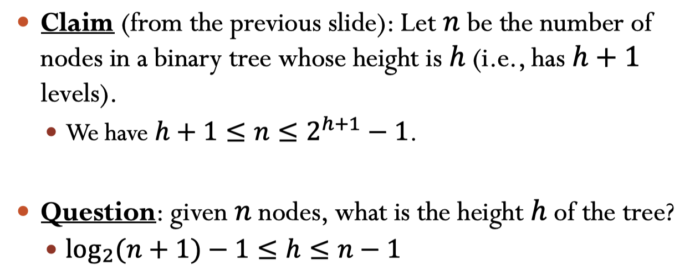
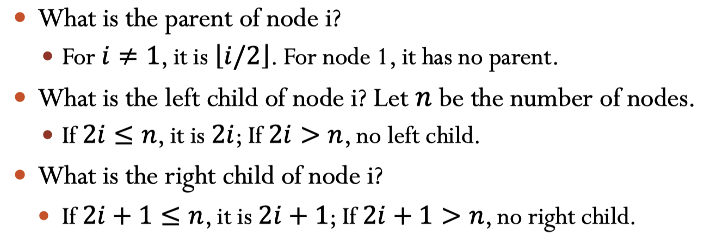
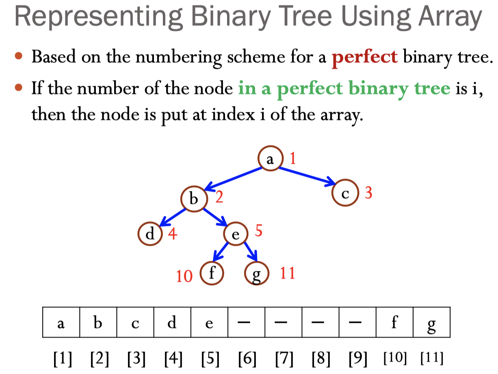
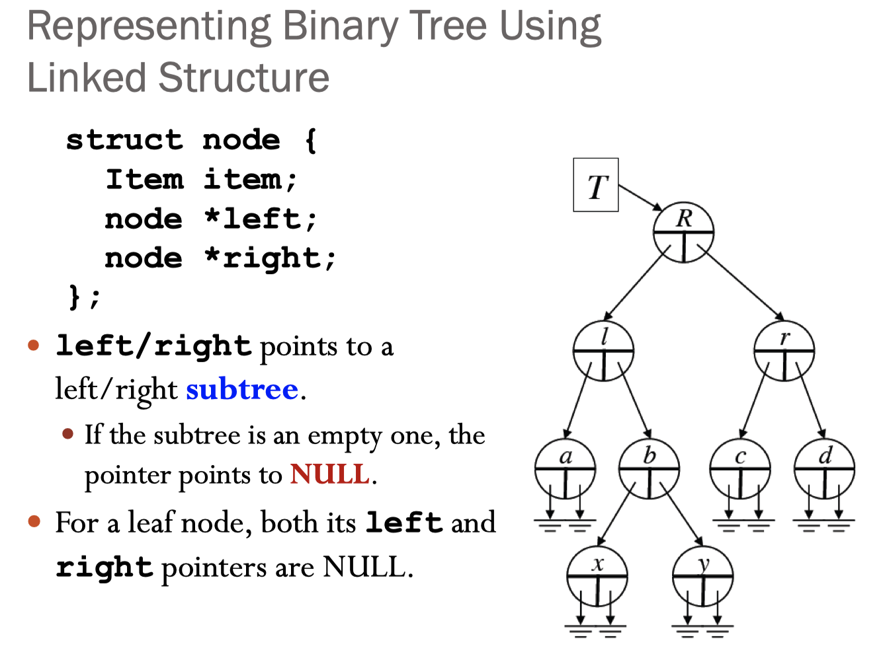

# 10-Trees

## I. Objectives

- [ ] 知道树和二叉树的basic terminology
- [ ] 知道二叉树的基本性质
- [ ] 知道如何用array和linked list来表示二叉树

## II. Basic Terminology of Tree

- **Root:** 最顶部的node
- **Edges:** 连接node的东西
- **Leaf:** 没有parent的node
- **Subtrees:** 任何node都有subtree

- **Siblings:** 享有同一个parent.

- ### Path

  ​	连接两个node之间的路径，path length是中间edges的个数。

  <u>**Claim:**</u> 如果两个nodes之间存在一条path，那么这个path一定是两个节点之间唯一的

  另外如果从A出发到B有path，那么A是B的**ancestor**, B是A的**descendant**。

- ### Depth, Level, and Height of a Node

  ​	**depth**和**level**说的是同一个东西，指的是从root出发的unique path的长度。

  ​	**height**指的是从node到leaf的<u>**最长**</u>的路径，所以所有leaf node的height都是0.

- ### Depth, Level and Height of a Tree

  ​	**Height/level of a tree**说的是root的height. 在下图中是3

  ​	**The number of levels of the tree**是==height of the tree + 1== 下图中是4

- ### Degree of a node

  ​	degree of a node指的是一个节点children的个数

- ### Degree of a tree

  ​	degree of a tree指的是所有节点中degree的最大值

## III. Binary Tree

- 定义：每个节点最多两个children，所以空的🌲也是binary 🌲

- 特点：

  - 一个高度为h的树最少有多少个节点？

    有h+1个，因为height 为h, level = h + 1,每个level最少一个节点

  - 一个高度为h的树最多多少个节点？

    有$2^{h+1}-1$个,因为每层最多$2^k$个

    

- ### 三种类型的binary tree

  1. **Proper:** 每个节点都只有0/2个children
  2. **Complete:** 除了最低的level，其他每个level都是满的；并且最低的level是populated from left to right.
  3. **Perfect:** 每层全是满的

- ### Numbering Nodes In a Perfect Binary Tree

  ​	从top 到bottom, 每层从左到右

**特点**：每个节点的left child都是这个node的两倍，除了leaf node。Right child = 2*i + 1;

- ### 如何用用数据结构表示二叉树？

  

